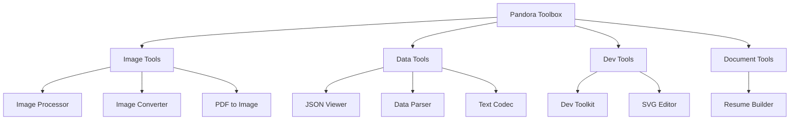

# Pandora - Local-First Browser Utility Toolbox

> A Vue 3-based PWA offering multiple offline-capable developer tools. All processing happens locally in the browser using Web Workers, WASM, and modern web APIs.

## Project Vision

Pandora is a "local-first" toolbox designed to operate entirely within the browser sandbox. No data is uploaded to any server. The application leverages cutting-edge web technologies (WASM, Web Workers, OffscreenCanvas) to provide professional-grade image processing, PDF manipulation, data transformation, and developer utilities.

**Core Principles:**

- Privacy: All data stays in the browser
- Performance: Heavy computation runs in Web Workers
- PWA: Installable, works offline
- Modern Stack: Vue 3 + TypeScript + Vite

## Architecture Overview

```text
pandora/
├── src/
│   ├── main.ts              # Application entry (ViteSSG)
│   ├── App.vue              # Root component with router-view
│   ├── views/               # Feature modules (route pages)
│   ├── components/          # Shared UI components
│   ├── lib/                 # Core libraries (workers, storage, processors)
│   ├── stores/              # Pinia store setup
│   ├── router/              # Vue Router configuration
│   ├── composables/         # Vue composables
│   ├── utils/               # Utility functions
│   ├── styles/              # Global styles (SCSS)
│   ├── assets/              # Static assets
│   └── auto-typings/        # Generated TypeScript declarations
├── public/
│   ├── pdfjs/               # PDF.js cmaps and fonts
│   └── svgedit/             # SVG editor dependencies
├── plugins/                 # Vite plugins (icon server)
└── cypress/                 # E2E tests
```

**Technology Stack:**

- Framework: Vue 3.5 + TypeScript 5.9
- Build: Vite 7 + vite-ssg (SSG/SPA hybrid)
- Styling: UnoCSS with Pandora Design System
- State: Pinia + localforage (persistent storage)
- Code Editor: Monaco Editor
- Image: JSquash (WASM codecs)
- PDF: pdfjs-dist
- SVG: Fabric.js
- Charts: Chart.js

## Module Structure Diagram



## Module Index

| Module          | Path               | Description                                     | Key Technologies         |
| --------------- | ------------------ | ----------------------------------------------- | ------------------------ |
| Image Processor | `/image-processor` | Chrome Web Store icon/image exporter            | Canvas, JSquash          |
| Image Converter | `/image-converter` | Batch image format conversion & compression     | Web Worker, JSquash WASM |
| JSON Viewer     | `/json-viewer`     | Interactive JSON tree viewer                    | vue-json-pretty          |
| Data Parser     | `/data-parser`     | Excel/CSV to JSON with TS type generation       | ExcelJS, Monaco Editor   |
| Text Codec      | `/text-codec`      | Base64, URL, Hash, JWT, Unicode encoder/decoder | crypto.subtle, js-md5    |
| Dev Toolkit     | `/dev-toolkit`     | Regex tester, timestamp, color picker, diff     | dayjs, LCS diff          |
| SVG Editor      | `/svg-editor`      | Interactive SVG editor with live preview        | Fabric.js, Monaco Editor |
| PDF to Image    | `/pdf-to-image`    | PDF page rendering to images                    | pdfjs-dist, Web Worker   |
| Resume Builder  | `/resume-builder`  | Markdown-based resume with PDF export           | marked                   |

## Running and Development

```bash
# Install dependencies
pnpm install

# Development server (localhost:5173)
pnpm dev

# Build for production (SSG)
pnpm build

# Preview production build
pnpm preview

# Type checking
pnpm type-check

# Linting
pnpm lint

# Unit tests
pnpm test:unit

# E2E tests
pnpm test:e2e
```

**Environment Requirements:**

- Node.js 22+
- pnpm (recommended)

## Testing Strategy

- **Unit Tests**: Vitest with jsdom environment
- **E2E Tests**: Cypress (configured but minimal coverage)
- **Type Checking**: vue-tsc as part of build pipeline

**Test Locations:**

- Unit: No dedicated test files yet (Vitest configured)
- E2E: `cypress/e2e/` - basic example test exists

## Coding Standards

### Style Guide

- ESLint: `@antfu/eslint-config` with UnoCSS support
- Formatter: Prettier (via ESLint plugin)
- Imports: Auto-imported via `unplugin-auto-import`

### Naming Conventions

- Vue components: PascalCase (e.g., `ThemeToggle.vue`)
- Views: kebab-case (e.g., `image-converter.vue`)
- Composables: camelCase with `use` prefix (e.g., `useTheme`)
- Utils: camelCase functions

### File Organization

- Views are auto-routed from `src/views/`
- Components are auto-registered from `src/components/`
- Each feature is self-contained in its view file

## AI Usage Guidelines

### When Working with This Codebase

1. **Understand the Local-First Architecture**
   - All processing happens in the browser
   - Data persists via localforage (IndexedDB)
   - Workers handle heavy computation

2. **Key Patterns to Follow**
   - Use Comlink for Web Worker communication
   - Follow the existing view structure: header + main (split-pane common)
   - Use Pandora Design System tokens (`pd-*` CSS variables)

3. **Common Modifications**
   - Adding a new tool: Create `src/views/new-tool.vue`, it auto-registers as `/new-tool`
   - Adding shared components: Place in `src/components/`
   - Adding utilities: Place in `src/utils/` or `src/lib/`

4. **Worker Pattern Example**

   ```typescript
   // src/lib/xxx.worker.ts
   import * as Comlink from 'comlink'

   // In view
   import XxxWorker from '@/lib/xxx.worker?worker'

   const api = { /* methods */ }
   Comlink.expose(api)
   export type XxxWorkerAPI = typeof api
   const worker = new XxxWorker()
   const workerApi = Comlink.wrap<XxxWorkerAPI>(worker)
   ```

### Important Files to Reference

| File                         | Purpose                                |
| ---------------------------- | -------------------------------------- |
| `vite.config.ts`             | Build config, plugins, chunk splitting |
| `unocss.config.ts`           | Pandora Design System tokens           |
| `src/lib/storage.ts`         | localforage storage layer              |
| `src/lib/image-processor.ts` | WASM image processing                  |
| `src/lib/pdf.worker.ts`      | PDF rendering worker                   |

## Changelog

### 2026-04-07

- Initialized AI context documentation
- Scanned 45+ source files across 9 functional modules
- Documented architecture, dependencies, and development patterns
